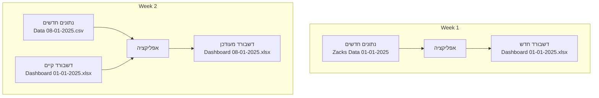

### הצעה לתצורת עבודה בעזרת אפליקציה לעדכון דשבורד יומי

```mermaid
flowchart TD
    subgraph Week1 [Week 1]
      A[נתונים חדשים <br> Zacks Data 01-01-2025]
      B[אפליקציה]
      C[דשבורד חדש <br> Dashboard 01-01-2025.xlsx]
    end

    subgraph Week2 [Week 2]
      A1[נתונים חדשים <br> Data 08-01-2025.csv]
      D[דשבורד קיים <br> Dashboard 01-01-2025.xlsx]
      B1[אפליקציה]
      C1[דשבורד מעודכן <br> Dashboard 08-01-2025.xlsx]
    end

    %% Week 1 Flow
    A --> B
    B --> C

    %% Week 2 Flow (uses new data and previous dashboard)
    A1 --> B1
    D --> B1
    B1 --> C1

```
